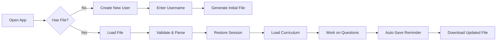

# AP Statistics Educational Platform - Foundation Document v2.0

## Executive Summary

This document defines the architecture, data flows, and implementation requirements for the next generation of the AP Statistics educational platform. The system prioritizes **resilience against cache clearing**, **transparent peer learning**, and **pedagogical effectiveness** through a file-based architecture where student progress files serve as both storage and homework artifacts.

---

## Core Philosophy

### 1. The File IS the Database
- Student progress files are not exports - they ARE the primary storage
- No dependency on browser storage (localStorage, IndexedDB, cookies)
- Files are pedagogical artifacts that students are responsible for maintaining
- "Losing your file = losing your homework" teaches digital responsibility

### 2. Transparent Peer Learning
- **NO anonymization** - students see peer names with their answers
- Enables identification of study partners and subject matter experts
- Creates accountability and motivates quality explanations
- Fosters collaborative learning culture vs competitive isolation

### 3. Progressive Enhancement
- App works with just personal data (no peer data required)
- Enhanced with peer insights when available
- Gracefully handles missing curriculum files
- Never breaks due to missing dependencies

---

## System Architecture

### Data Layer Structure

```javascript
{
  "version": "2.0",
  "schemaType": "student_progress",
  "metadata": {
    "username": "Apple_Rabbit",
    "created": "2024-09-01T10:00:00Z",
    "lastModified": "2024-09-20T15:30:00Z",
    "appVersion": "2.0.0",
    "totalSessions": 45
  },
  
  // LAYER 1: Personal Data (NEVER modified by imports)
  "personalData": {
    "answers": {
      "U1-L2-Q01": {
        "value": "E",
        "timestamp": "2024-09-15T14:23:00Z",
        "reasoning": "I chose E because...",
        "confidence": 4,  // 1-5 scale
        "timeSpent": 245, // seconds
        "attempts": 2
      }
    },
    "notes": {
      "U1-L2": "Remember: categorical vs quantitative distinction"
    },
    "bookmarks": ["U1-L3-Q02", "U2-L1-Q05"],
    "flags": {
      "U1-L4-Q03": "need_help",
      "U2-L2-Q01": "review_later"
    }
  },
  
  // LAYER 2: Session State (Persisted for continuity)
  "sessionState": {
    "currentUnit": 1,
    "currentLesson": 3,
    "currentQuestion": 2,
    "lastActivity": "2024-09-20T15:30:00Z",
    "viewPreferences": {
      "showPeerAnswers": true,
      "sortPeersBy": "correctness",
      "chartType": "preferred"
    },
    "progress": {
      "unitsCompleted": [1],
      "lessonsCompleted": ["U1-L1", "U1-L2"],
      "questionsAnswered": 47,
      "correctAnswers": 38
    }
  },
  
  // LAYER 3: Peer Data (REPLACED on each teacher import)
  "peerData": {
    "lastUpdated": "2024-09-19T09:00:00Z",
    "source": "Mr_Smith_Period_3",
    "totalPeers": 36,
    "peers": {
      "Banana_Goat": {
        "U1-L2-Q01": {
          "value": "E",
          "reasoning": "One_half_of_students = 150...",
          "timestamp": "2024-09-15T13:45:00Z"
        }
      },
      "Cherry_Monkey": {
        "U1-L2-Q01": {
          "value": "C",
          "reasoning": "I think C because...",
          "timestamp": "2024-09-15T14:10:00Z"
        }
      }
      // ... remaining 34 peers
    },
    "statistics": {
      "U1-L2-Q01": {
        "distribution": {"A": 2, "B": 5, "C": 8, "D": 3, "E": 19},
        "consensus": 0.51,
        "correctAnswer": "E",
        "averageConfidence": 3.2,
        "medianTimeSpent": 180
      }
    },
    "insights": {
      "topPerformers": ["Kiwi_Panda", "Mango_Elephant", "Plum_Iguana"],
      "commonMisconceptions": {
        "U1-L2-Q01": "Students choosing C confused 'supported' with 'not supported'"
      }
    }
  },
  
  // LAYER 4: Cached Curriculum (Optional, for offline work)
  "curriculumCache": {
    "units": {
      "1": { /* Unit 1 curriculum data */ },
      "2": { /* Unit 2 curriculum data */ }
    },
    "lastFetched": "2024-09-01T10:00:00Z"
  }
}
```

---

## Data Flow Specifications

### 1. Student Workflow



### 2. Import/Export Cycle

```javascript
// STUDENT → TEACHER
exportForTeacher() {
  return {
    username: this.metadata.username,
    exportTime: new Date().toISOString(),
    answers: this.personalData.answers,
    // Include only what teacher needs for aggregation
  };
}

// TEACHER → STUDENTS  
importFromTeacher(teacherExport) {
  // CRITICAL: Never modify personalData
  this.peerData = {
    lastUpdated: teacherExport.exportTime,
    source: teacherExport.className,
    totalPeers: Object.keys(teacherExport.students).length - 1, // Exclude self
    peers: this.filterOutSelf(teacherExport.students),
    statistics: teacherExport.statistics,
    insights: teacherExport.insights
  };
  
  // Mark file as modified
  this.metadata.lastModified = new Date().toISOString();
  this.triggerSaveReminder();
}

filterOutSelf(allStudents) {
  const filtered = {...allStudents};
  delete filtered[this.metadata.username];
  return filtered;
}
```

### 3. File Integrity Protection

```javascript
class FileIntegrityManager {
  validateFile(fileData) {
    // Check version compatibility
    if (!this.isVersionCompatible(fileData.version)) {
      return { valid: false, error: "Incompatible version" };
    }
    
    // Verify structure
    const requiredFields = ['metadata', 'personalData'];
    for (const field of requiredFields) {
      if (!fileData[field]) {
        return { valid: false, error: `Missing ${field}` };
      }
    }
    
    // Verify username hasn't changed
    if (this.currentUsername && fileData.metadata.username !== this.currentUsername) {
      return { valid: false, error: "Username mismatch" };
    }
    
    // Check data integrity
    const checksum = this.calculateChecksum(fileData.personalData);
    if (fileData.metadata.checksum && fileData.metadata.checksum !== checksum) {
      return { valid: false, error: "Data integrity check failed" };
    }
    
    return { valid: true };
  }
  
  calculateChecksum(data) {
    // Simple checksum for data integrity
    const str = JSON.stringify(data);
    let hash = 0;
    for (let i = 0; i < str.length; i++) {
      const char = str.charCodeAt(i);
      hash = ((hash << 5) - hash) + char;
      hash = hash & hash; // Convert to 32-bit integer
    }
    return hash.toString(16);
  }
}
```

---

## Curriculum Integration

### Loading Hierarchy

1. **Check curriculum cache** in student file
2. **Fetch from JSON files** (unit1.json, unit2.json, etc.)
3. **Fall back to embedded minimum** curriculum
4. **Show degraded UI** if no curriculum available

### Curriculum Data Structure

```javascript
{
  "unitNumber": 1,
  "unitName": "Exploring One-Variable Data",
  "lessons": {
    "2": {
      "name": "Categorical Variables",
      "questions": [
        {
          "id": "U1-L2-Q01",
          "type": "multiple_choice",
          "text": "Which of the following is a categorical variable?",
          "choices": ["Height", "Weight", "Color", "Temperature", "Distance"],
          "correctAnswer": "C",
          "explanation": "Color is categorical because...",
          "charts": [
            {
              "chartType": "bar",
              "chartData": { /* Chart configuration */ }
            }
          ],
          "videoHelp": "https://..."
        }
      ]
    }
  }
}
```

---

## The Golden RenderChart Function

### Integration Requirements

The `renderChart` function is **IMMUTABLE** - it works perfectly and must not be modified. The system must:

1. **Preserve the exact function signature**: `renderChart(chartData, questionId)`
2. **Maintain all chart types**: bar, histogram, dotplot, boxplot, scatterplot, etc.
3. **Keep color generation**: `generateChartColors(count)`
4. **Preserve all configuration options**: stacked, horizontal, gridlines, etc.

### Enhanced Wrapper for Peer Data

```javascript
function renderChartWithPeerOverlay(originalChartData, questionId, peerResponses) {
  // Create a copy to avoid modifying original
  const enhancedData = JSON.parse(JSON.stringify(originalChartData));
  
  if (peerResponses && enhancedData.chartType === 'dotplot') {
    // Add peer response dots
    enhancedData.peerLayer = {
      show: true,
      responses: peerResponses,
      highlight: this.currentUsername
    };
  }
  
  // Call the golden function
  renderChart(enhancedData, questionId);
  
  // Add peer overlay after chart renders
  if (peerResponses) {
    setTimeout(() => {
      this.addPeerAnnotations(questionId, peerResponses);
    }, 100);
  }
}
```

---

## User Interface Requirements

### Critical UI Elements

1. **Persistent Save Warning Banner**
   - Fixed position at top of screen
   - Shows save status and time since last save
   - One-click quick save button
   - Pulsing animation when unsaved > 5 minutes

2. **File Management Panel**
   ```html
   <div class="file-manager">
     <div class="current-file">
       <span class="username">Apple_Rabbit</span>
       <span class="status-indicator">● Unsaved Changes</span>
       <span class="last-saved">Last saved: 5 minutes ago</span>
     </div>
     <div class="file-actions">
       <button onclick="loadFile()">Load Progress File</button>
       <button onclick="saveFile()">Save Progress File</button>
       <button onclick="importPeerData()">Import Class Data</button>
     </div>
   </div>
   ```

3. **Peer Learning Interface**
   ```javascript
   renderPeerAnswers(questionId) {
     const myAnswer = this.personalData.answers[questionId];
     const peers = this.peerData.peers;
     const stats = this.peerData.statistics[questionId];
     
     return {
       myAnswer: this.renderOwnAnswer(myAnswer),
       correctAnswer: this.renderCorrectAnswer(stats.correctAnswer),
       distribution: this.renderDistribution(stats.distribution),
       peerExplanations: this.renderPeerExplanations(peers, questionId),
       filters: this.renderPeerFilters(),
       insights: this.renderInsights(stats)
     };
   }
   ```

### View Modes

1. **Solo Mode** - Just personal work, no peer data
2. **Peer Learning Mode** - Full peer data with names
3. **Review Mode** - Focus on incorrect answers with peer explanations
4. **Study Group Mode** - Highlight specific peer subset

---

## Implementation Checklist

### Phase 1: Core File System
- [ ] File creation with proper structure
- [ ] File loading and validation
- [ ] Save/download functionality
- [ ] Auto-save reminders
- [ ] Session recovery from file
- [ ] File integrity checking

### Phase 2: Personal Work Flow
- [ ] Question answering interface
- [ ] Reasoning text input
- [ ] Confidence tracking
- [ ] Time spent tracking
- [ ] Personal notes system
- [ ] Bookmark/flag system

### Phase 3: Curriculum Integration
- [ ] Dynamic unit loading
- [ ] Lesson progression
- [ ] Question rendering
- [ ] RenderChart integration
- [ ] Video help system
- [ ] MathJax rendering

### Phase 4: Peer Learning
- [ ] Teacher export parsing
- [ ] Peer data import (non-destructive)
- [ ] Peer answer display WITH NAMES
- [ ] Consensus visualization
- [ ] Study partner identification
- [ ] Peer filtering/sorting

### Phase 5: Enhanced Features
- [ ] Progress analytics
- [ ] Performance trends
- [ ] Study recommendations
- [ ] Export for portfolio
- [ ] Offline mode
- [ ] Mobile responsiveness

---

## Security & Privacy Considerations

### Data Protection
- No sensitive data in URLs
- No data transmission to servers
- File encryption optional (user choice)
- Clear data ownership (student owns their file)

### Peer Privacy Controls
- Teacher can exclude specific students from export
- Students can request anonymization (handled by teacher)
- Reasoning text can be filtered for inappropriate content
- No grades or scores shared, only answers/reasoning

---

## Migration Strategy

### From Current Version
1. Export current localStorage/IndexedDB data
2. Transform to new file structure
3. Preserve all answers and reasoning
4. Generate metadata from existing data
5. Validate migrated file
6. Archive old data

### Backwards Compatibility
- Support reading v1.0 files
- Auto-upgrade old structures
- Preserve all historical data
- Clear migration messages

---

## Performance Specifications

### File Size Management
- Target: < 500KB per student file
- Compress reasoning text if needed
- Limit peer data to essential fields
- Curriculum cache optional

### Load Time Requirements
- File load: < 500ms
- Parse and validate: < 200ms
- Render first question: < 1 second
- Peer data merge: < 300ms

### Browser Compatibility
- Chrome 90+
- Firefox 88+
- Safari 14+
- Edge 90+
- No IE support

---

## Error Handling

### Critical Errors (Block Progress)
- Invalid file structure
- Username mismatch
- Corrupted personal data
- Version incompatibility

### Warning Errors (Allow Continue)
- Missing peer data
- Outdated curriculum cache
- Network issues loading units
- Chart rendering failures

### Recovery Strategies
- Auto-backup before operations
- Rollback on import failure
- Session recovery from crashes
- Manual file repair tools

---

## Quality Assurance

### Testing Requirements
1. **File Operations**
   - Create, save, load cycles
   - Import without data loss
   - Corruption recovery
   - Large file handling

2. **Peer Learning**
   - Import with 40+ students
   - Self-filtering verification
   - Statistics accuracy
   - Performance with full class

3. **Cache Resilience**
   - Clear all browser data → verify recovery
   - Private browsing mode → full functionality
   - Cross-device file portability
   - Offline operation

---

## Success Metrics

### Technical
- Zero data loss incidents
- < 1% file corruption rate  
- 100% cache-clear survival
- < 2 second load time

### Pedagogical
- Increased peer interaction
- Higher explanation quality
- Study group formation
- Improved comprehension

### Operational
- Reduced IT support tickets
- Simplified teacher workflow
- Student file responsibility
- Platform independence

---

## Appendices

### A. Sample Files
- [Empty starter file](starter_template.json)
- [Complete student file](sample_student_complete.json)
- [Teacher export file](sample_teacher_export.json)
- [Migrated v1 file](sample_migrated.json)

### B. API Reference
- File structure schemas
- Function signatures
- Event handlers
- Error codes

### C. Deployment Guide
- Static hosting setup
- CDN configuration
- Curriculum file hosting
- Update procedures

---

## Version History

| Version | Date | Changes |
|---------|------|---------|
| 2.0 | 2024-09-20 | Complete rewrite for file-based architecture |
| 1.0 | 2024-01-15 | Initial localStorage version |

---

## Contact & Support

**Development Team**: [Your Team]  
**Educational Advisor**: [Curriculum Expert]  
**Technical Support**: [Support Contact]  
**Repository**: [GitHub/GitLab Link]

---

*This document is the authoritative specification for the AP Statistics Educational Platform v2.0. Any deviations must be documented and approved.*